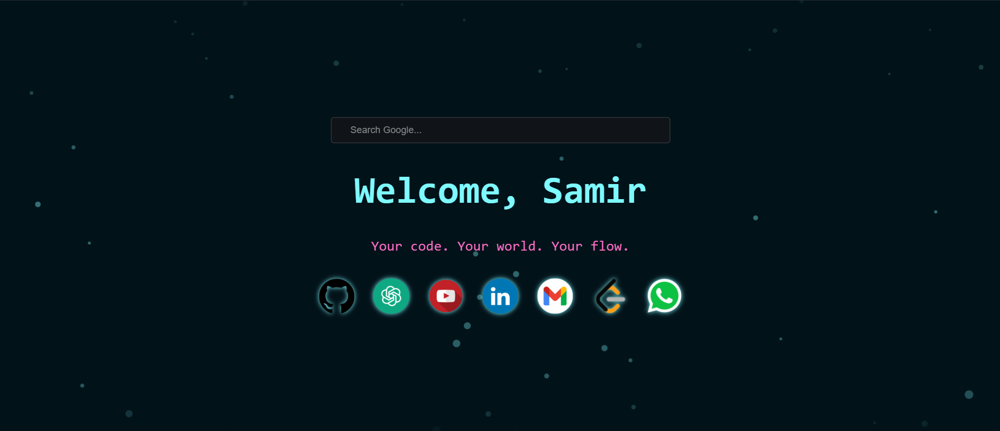

# Neon Developer NTP 🔥

A **futuristic, neon-themed New Tab page** designed for developers.  
Upgrade your browser’s new tab with a **minimalist, neon aesthetic**, custom **search**, **recent site shortcuts**, and subtle **animated background particles**.

---

## 🌟 Features

- **Custom Google Search** right from the new tab.
- **Neon floating particles** for a dynamic, futuristic look.
- **Neon glowing text** with animated flicker effect.
- **Quick access icons** for popular sites:
  - GitHub, ChatGPT, YouTube, LinkedIn, Gmail, LeetCode, WhatsApp
- Fully **responsive design** and works on all screen sizes.
- **Dark theme** optimized for developers who love coding in dark mode.

---

## 🖼 Screenshots

  
*Replace this with an actual screenshot of your new tab page.*

---

## 💻 Installation (Chrome)

1. Clone or download this repository:
   ```bash
   git clone https://github.com/samir-27/neontheme-chrome-extention.git
